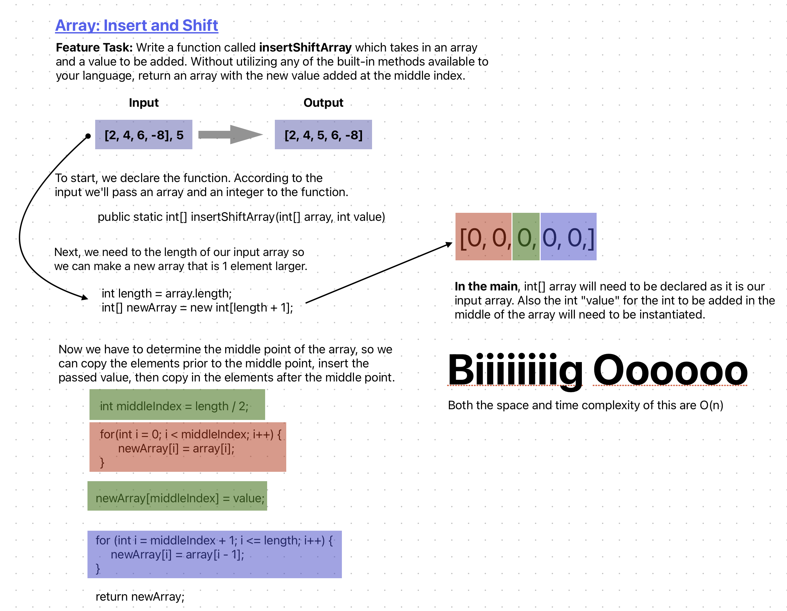

# Code Challenge: Class 02

The purpose of this challenge is to whiteboard insert an integer into an array and shift the pre-existing constituents 'making room' for the new int. 

## Whiteboard Process

## Approach & Efficiency

The BigO complexity is O(n) for the mapped out idea here. The idea with this algorithm was simply determine the mid point of the array, copy elements before the mid point into the new array, then insert the value to be added, then continue to copy in the remaining elements. So it procedurally fills the elements of the new array in order from 0 to (5 in my example) whatever "int value" is assigned.

## Solution

Not applicable to this Code Challenge.