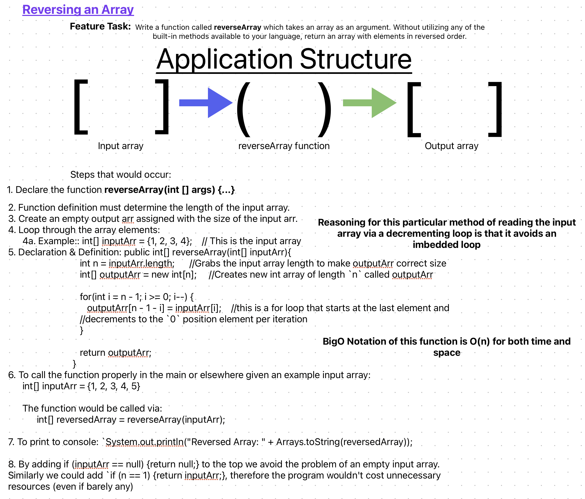

# Challenge 01: Array Reverse

Write a function called reverseArray which takes an array as an argument. Without utilizing any of the built-in methods available to your language, return an array with elements in reversed order.

## Whiteboard Process

## Approach & Efficiency

The idea I had for solving this was to create an array within my function that would read via a decrementing if loop the input array assigning the reverse order of elements into my output array. 

## Solution

Not applicable to this Code Challenge