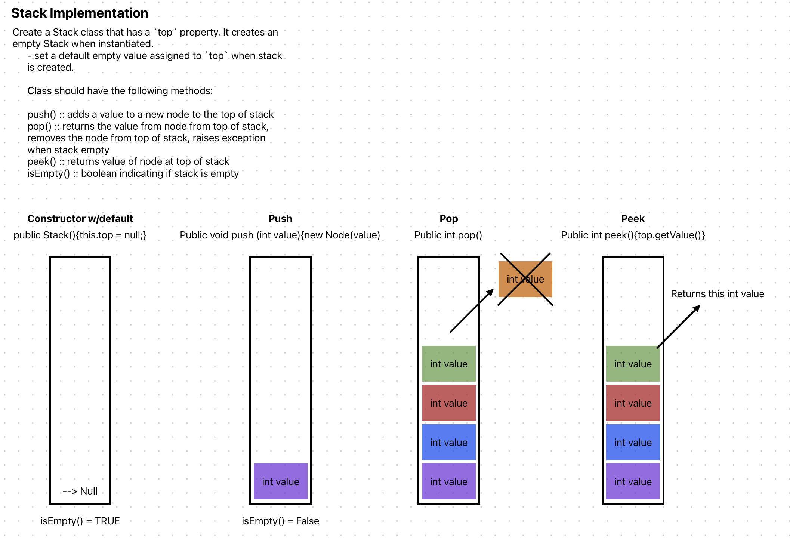

# Code Challenge: Class 10: Stack Implementation
This file is part of CC10 along with the Stack.java file
This challenge uses a linked list as the underlying data storage mechanism and implements bot a stack and a queue.

**Stack Data Structure Methods:**
* pop()
* peek()
* push(T value)
* isEmpty()

## Whiteboard Process

## Approach & Efficiency
Using Node.java from my datastructures.linkedlist.Node package

O(1) implementation

## Solution
<!-- Show how to run your code, and examples of it in action -->