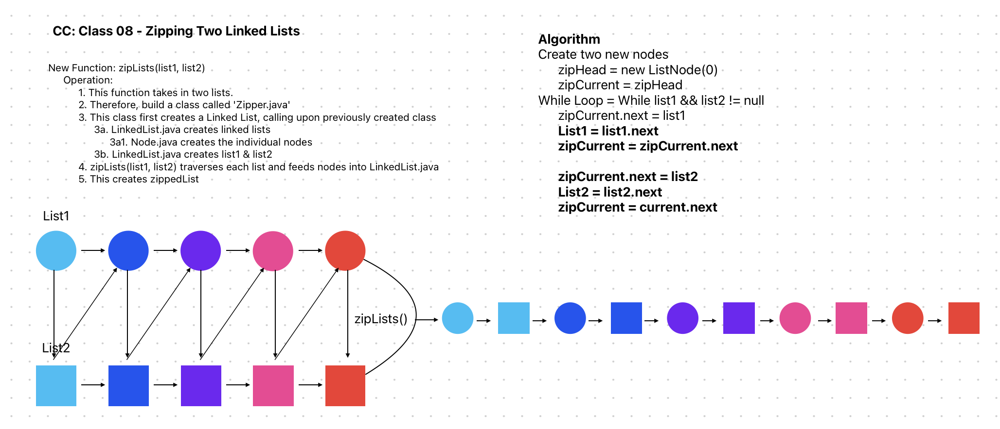

# Code Challenge: Class 8: Zipping two linked lists

Challenge Type: Code Challenge / Algorithm

Feature Tasks
* Write a function called zip lists
* Arguments: 2 Linked Lists
* Return: New Linked List, zipped as noted below
* Zip the two linked lists together into one so that the nodes alternate between the two lists and return a reference to the zipped list.
* Try and keep additional space down to O(1)
* You have access to the Node class and all the properties on the Linked List class as well as the methods created in previous challenges.

## Whiteboard Process

## Approach & Efficiency
leap frogging nodes and adding nodes from L1 and L2 to zipperedList

## Solution
```java
package zipLists;
import datastructures.linkedlist.Node;
public class ZipperLinkedLists {
    public Node zipLists(Node list1, Node list2) {
        Node dummyHead = new Node(0);
        Node current = dummyHead;

        while (list1 != null && list2 != null) {
            // Take an element from list1
            current.setNext(list1);
            list1 = list1.getNext();
            current = current.getNext();

            // Take an element from list2
            current.setNext(list2);
            list2 = list2.getNext();
            current = current.getNext();
        }

        // Append remaining elements from list1, if any
        if (list1 != null) {
            current.setNext(list1);
        }

        // Append remaining elements from list2, if any
        if (list2 != null) {
            current.setNext(list2);
        }

        // Save the zipperedList
        Node zipperedList = dummyHead.getNext();

        return zipperedList;
    }
}

`