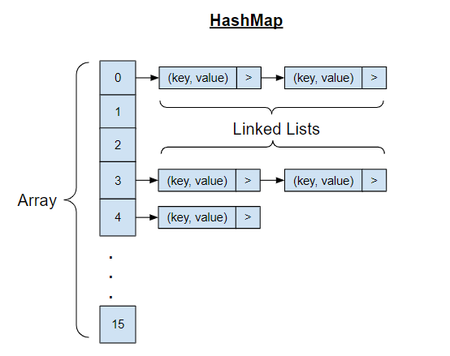

# Code Challenge: Class 31 - Hashmap Repeated Word

Feature Tasks
Write a function called repeated word that finds the first word to occur more than once in a string
Arguments: string
Return: string

## Whiteboard Process




## Approach & Efficiency
The HashMapStrings class provides a set of utility functions for working with strings and performing various text 
analysis tasks using hash maps. Here's a brief overview of each function, its approach, and its efficiency:

findFirstRepeatedWord
This function takes a string input and finds the first repeated word within it. The approach involves splitting the 
input into individual words and using a HashSet to keep track of seen words. If a word is encountered that's already 
in the set, it's identified as the first repeated word.

Approach: Split input, track seen words using HashSet.
Time Complexity: O(n), where n is the number of words in the input.
Space Complexity: O(m), where m is the number of unique words.
countWords
Given a string input, this function counts the occurrences of each word and returns a map containing word counts.

Approach: Split input, use HashMap to store word counts.
Time Complexity: O(n), where n is the number of words in the input.
Space Complexity: O(m), where m is the number of unique words.
mostFrequentWords
This function returns a list of the most frequent words in the input, along with their counts. It utilizes the 
countWords function to build a max heap of word counts and then retrieves the most frequent words from the heap.

Approach: Use countWords, create max heap of word counts.
Time Complexity: O(n + k log k), where n is the number of words, and k is the number of unique words.
Space Complexity: O(m + k), where m is the number of unique words and k is the number of most frequent words to retrieve.
readTextFromFile
This function reads the content of a text file given its file path and returns the content as a string.

Approach: Use BufferedReader to read lines, append to StringBuilder.
Time Complexity: O(n), where n is the number of characters in the file.
Space Complexity: O(n), where n is the number of characters in the file.
These utility functions are designed to be efficient for common use cases involving text analysis. They provide 
essential functionalities for working with strings and performing various text-related tasks.

## Solution

***pseudo code:***
```java
Function findFirstRepeatedWord(input: string) -> string:
words = Split input into words
seenWords = Empty set

    for word in words:
        if word in seenWords:
            return word
        Add word to seenWords
    
    return None

Function countWords(input: string) -> Map<string, integer>:
words = Split input into words
wordCount = Empty map

    for word in words:
        wordCount[word] = wordCount[word] + 1 (or set to 1 if not exists)
    
    return wordCount

Function mostFrequentWords(input: string, numWords: integer) -> List<string>:
wordCount = countWords(input)
maxHeap = Create max heap from wordCount

    mostFrequent = Empty list
    while numWords > 0 and maxHeap is not empty:
        entry = Get entry from maxHeap
        mostFrequent.add(entry.key)
        numWords = numWords - 1
    
    return mostFrequent

Function repeatedWordWithCount(input: string) -> string:
wordCount = countWords(input)

    for word in wordCount:
        if wordCount[word] > 1:
            return word
    
    return None
```
