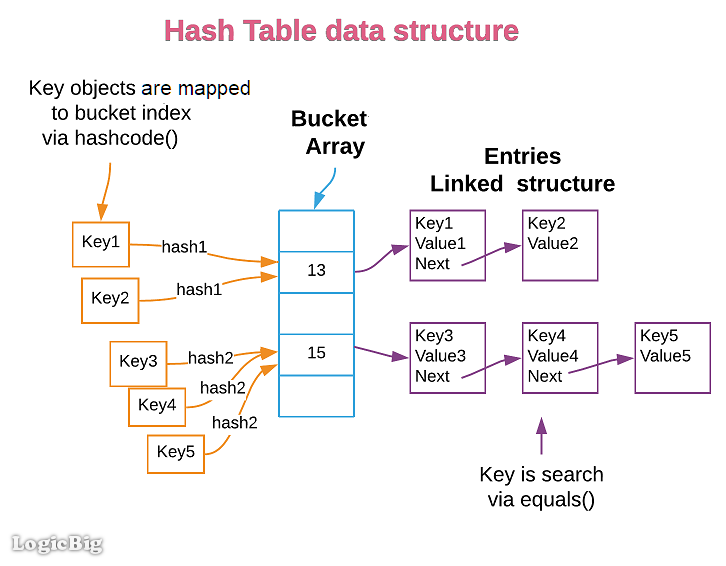

# CF401 Code Challenge: Class 30: Hash Table Implementation

Implement a Hashtable with the following methods:

* set
  * Arguments: key, value
  * Returns: nothing
  * This method should hash the key, and add the key and value pair to the table, handling collisions as needed.
  * Should a given key already exist, replace its value from the `value` argument to this method.
* get
  * Arguments: key
  * Returns: Value associated with that key in the table
* has
  * Arguments: key
  * Returns: Boolean, indicating if the key exists in the table already.
* keys
  * Arguments: none
  * Returns: Collection of keys
* hash
  * Arguments: key
  * Returns: Index in the collection for that key

Utilize the Single-responsibility principle: any methods you write should be clean, reusable, abstract component parts
to the whole challenge. You will be given feedback and marked down if you attempt to define a large, complex algorithm
in one function definition.

Be sure to follow your language/frameworks standard naming conventions (e.g. C# uses PascalCasing for all method and class names).

Any exceptions or errors that come from your code should be contextual, descriptive, capture-able errors. For example,
rather than a default error thrown by your language, your code should raise/throw a custom error that describes what
went wrong in calling the methods you wrote for this lab.

Write tests to prove the following functionality:

1. Setting a key/value to your hashtable results in the value being in the data structure
2. Retrieving based on a key returns the value stored
3. Successfully returns null for a key that does not exist in the hashtable
4. Successfully returns a list of all unique keys that exist in the hashtable
5. Successfully handle a collision within the hashtable
6. Successfully retrieve a value from a bucket within the hashtable that has a collision
7. Successfully hash a key to an in-range value

## Whiteboard Process




## Approach & Efficiency

**Approach:**

The provided HashTable class implements a basic hash table data structure using separate chaining for handling 
collisions. Here's how it works:

1. Initialization: The hash table is initialized with an array of linked lists (buckets), where each linked list will 
hold key-value pairs that hash to the same index.

2. Hash Function: The class includes a private hash function that maps keys to bucket indices. The hash code of the key 
is calculated using the key's hashCode() method, and the bucket index is determined by taking the absolute value of 
the hash code modulo the number of buckets.

3. Set Operation: The set method takes a key and a value as parameters and inserts a new key-value pair into the hash 
table. It calculates the bucket index for the key and handles the collision by adding the pair to the linked list 
(chain) at that index. If the key already exists in the linked list, its value is updated.

4. Get Operation: The get method retrieves the value associated with a given key. It calculates the bucket index, searches 
the linked list at that index, and returns the value if the key is found.

5. Has Operation: The has method checks if a given key exists in the hash table. It calculates the bucket index, searches 
the linked list, and returns true if the key is found and false otherwise.

6. Keys Operation: The keys method returns a list containing all the keys present in the hash table. It iterates through 
all the linked lists in the array, adding each key to the list.

7. Bucket Index for Key: The getBucketIndexForKey method calculates and returns the bucket index for a given key.

8. Size Operation: The size method returns the number of key-value pairs in the hash table.

**Efficiency:**

* Hashing: The hash function spreads the keys uniformly across the available buckets, aiming to minimize collisions 
and ensure efficient access.

* Collision Handling: Collisions are handled using separate chaining, where each bucket stores a linked list of key-value 
pairs that hash to the same index. This approach allows for efficient handling of collisions and ensures constant-time 
access to keys within a linked list.

* Space Complexity: The space complexity of the hash table is O(N + B), where N is the number of key-value pairs and B 
is the number of buckets. Since separate chaining is used, B is typically small compared to N, resulting in an 
average-case constant-time access for each key.

* Time Complexity:

* The set operation takes O(1) average-case time complexity, as it involves calculating the hash index and inserting the key-value pair in the linked list.
* The get operation also has an average-case time complexity of O(1), as it calculates the bucket index and then searches the linked list.
* The has operation has the same time complexity as the get operation, O(1) on average.
* The keys operation takes O(N) time to iterate through all the keys in the hash table.
* The size operation returns the size in O(1) time as it's stored as a separate variable.


Overall, the HashTable implementation provides an efficient way to store and retrieve key-value pairs, with a good balance between space and time complexity.

## Solution

Class HashTable<K, V>:
// Constructor
HashTable():
Initialize bucketArray with an array of linked lists of size INITIAL_SIZE
Set numBuckets to INITIAL_SIZE
Set size to 0

```java
    // Hash function
    Function hash(key):
        Calculate hash code using key's hashCode() method
        Calculate bucket index using hash code modulo numBuckets
        Return bucket index

    // Set method
    Function set(key, value):
        Calculate bucket index using hash(key)
        If bucketArray[bucketIndex] is empty:
            Create a new linked list at bucketArray[bucketIndex]
        Get the chain from bucketArray[bucketIndex]
        For each node in chain:
            If node's key equals key:
                Update node's value with the new value
                Return
        Increment size
        Add a new node with key and value to the chain

    // Get method
    Function get(key):
        Calculate bucket index using hash(key)
        Get the chain from bucketArray[bucketIndex]
        For each node in chain:
            If node's key equals key:
                Return node's value
        Return null

    // Has method
    Function has(key):
        Calculate bucket index using hash(key)
        Get the chain from bucketArray[bucketIndex]
        For each node in chain:
            If node's key equals key:
                Return true
        Return false

    // Keys method
    Function keys():
        Initialize an empty list keys
        For each chain in bucketArray:
            For each node in chain:
                Add node's key to keys
        Return keys

    // Get bucket index for key method
    Function getBucketIndexForKey(key):
        Calculate bucket index using hash(key)
        Return bucket index

    // Size method
    Function size():
        Return size
```