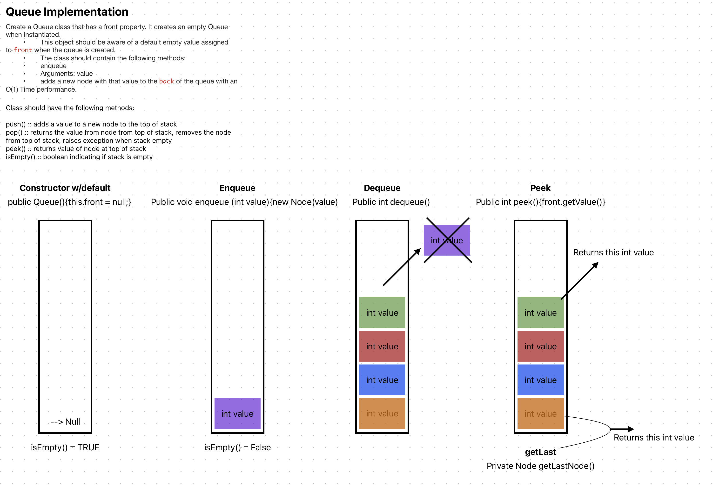

# Code Challenge: Class 10: Queue Implementation
This file is part of CC10 along with the Stack.java file
This challenge uses a linked list as the underlying data storage mechanism and implements bot a stack and a queue.

**Queue Data Structure Methods:**
* enqueue()
* dequeue()
* peek()
* isEmpty()

## Whiteboard Process

## Approach & Efficiency
using Node.java from my datastructures.linkedlist.Node file

O(1) complexity 

## Solution
<!-- Show how to run your code, and examples of it in action -->