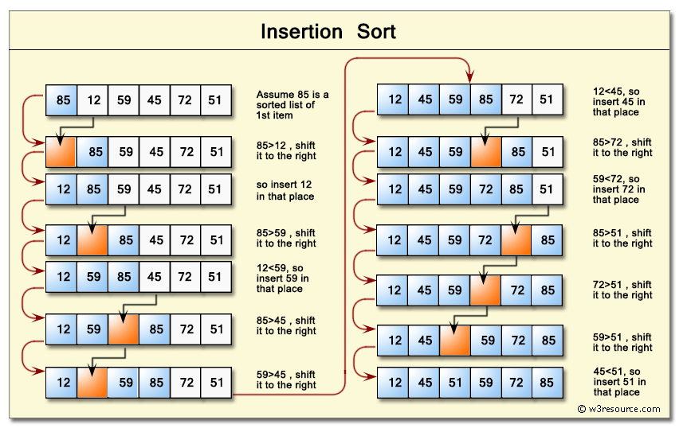

# Insertion Sort Blog
##### Code Fellows 401 Java: Code Challenge Class 26

```java 
// Pseudocode for the Insertion Sort Algorithm

// Function to insert a value into the sorted array
Insert(int[] sorted, int value)
// Start from the beginning of the sorted array
initialize i to 0

    // Find the correct position to insert 'value' in the sorted array
    WHILE value > sorted[i]
        set i to i + 1
    
    // Shift elements to make space for 'value' at the correct position
    WHILE i < sorted.length
        set temp to sorted[i]
        set sorted[i] to value
        set value to temp
        set i to i + 1
    
    // Append the 'value' to the sorted array
    append value to sorted

// Function to perform Insertion Sort on an input array
InsertionSort(int[] input)
// Initialize an empty array for sorted elements
LET sorted = New Empty Array

    // The first element of the input array is directly inserted into the sorted array
    sorted[0] = input[0]
    
    // Iterate through the input array starting from the second element
    FOR i from 1 up to input.length
        // Insert the current element into the sorted array
        Insert(sorted, input[i])
    
    // Return the sorted array
    return sorted
    
```

### Arrays to be Processed:

* Unsorted: [8,4,23,42,16,15]
* Reverse-sorted: [20,18,12,8,5,-2]
* Few uniques: [5,12,7,5,5,7]
* Nearly-sorted: [2,3,5,7,13,11]
___
#### Trace of Insertion Sort on Array A:

```java
[8,4,23,42,16,15]

// [4] is inserted before [8]
[4,8,23,42,16,15]

// [23] remains in place
[4,8,23,42,16,15]

// [16] is inserted before [23]
[4,8,16,23,42,15]

// [15] is inserted before [23]
[4,8,15,16,23,42]
```
___
#### Trace of Insertion Sort on Reverse-sorted Array:

```java
[20,18,12,8,5,-2]

// [-2] remains in place
[-2,20,18,12,8,5]

// [-2] remains in place, [18] is inserted before [20]
[-2,5,20,18,12,8]

// [-2] remains in place, [5] is inserted before [20]
[-2,5,8,20,18,12]

// [-2] remains in place, [8] is inserted before [20]
[-2,5,8,12,20,18]

// [-2] remains in place, [12] is inserted before [20]
[-2,5,8,12,18,20]
```
___
#### Trace of Insertion Sort on Few Uniques Array:

```java
[5,12,7,5,5,7]

// [12] remains in place
[5,12,7,5,5,7]

// [7] is inserted before [12]
[5,7,12,7,5,7]

// [7] remains in place, [12] is inserted before [7]
[5,7,5,12,7,7]

// [5] remains in place, [12] is inserted before [7]
[5,5,7,12,7,7]

// [5] remains in place, [7] is inserted before [12]
[5,5,7,7,12,7]

// [5] remains in place, [7] is inserted before [12]
[5,5,7,7,7,12]
```
___
#### Trace of Insertion Sort on Nearly-sorted Array:

```java
[2,3,5,7,13,11]

// [3] remains in place
[2,3,5,7,13,11]

// [5] remains in place
[2,3,5,7,13,11]

// [7] remains in place
[2,3,5,7,13,11]

// [11] is inserted before [13]
[2,3,5,7,11,13]

// [11] remains in place, [13] is inserted before [11]
[2,3,5,7,11,13]
```
___
## Efficiency

### Big O Time: O(n^2)

### Big O Space: O(1)

