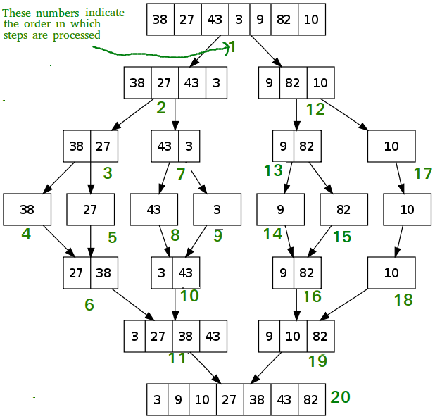

# Merge Sort Blog
##### Code Fellows 401 Java: Code Challenge Class 26

```java
ALGORITHM Mergesort(arr)
DECLARE n <-- arr.length

    // If the array has more than one element, proceed with sorting
    if n > 1
        DECLARE mid <-- n/2
        
        // Divide the array into two halves: left and right
        DECLARE left <-- arr[0...mid]
        DECLARE right <-- arr[mid...n]
        
        // Recursively sort the left half
        Mergesort(left)
        
        // Recursively sort the right half
        Mergesort(right)
        
        // Merge the sorted left and right halves back into the original array
        Merge(left, right, arr)

ALGORITHM Merge(left, right, arr)
DECLARE i <-- 0 // Pointer for the left subarray
DECLARE j <-- 0 // Pointer for the right subarray
DECLARE k <-- 0 // Pointer for the merged array

    // Compare elements from left and right subarrays and merge them in order
    while i < left.length && j < right.length
        if left[i] <= right[j]
            // If the current element in the left subarray is smaller or equal, place it in the merged array
            arr[k] <-- left[i]
            i <-- i + 1
        else
            // If the current element in the right subarray is smaller, place it in the merged array
            arr[k] <-- right[j]
            j <-- j + 1
        
        // Move the pointer in the merged array forward
        k <-- k + 1
    
    // After the loop, one of the subarrays might have remaining elements
    // If there are remaining elements in the left subarray
    if i = left.length
        // Copy the remaining elements from the right subarray to the merged array
        set remaining entries in arr to remaining values in right
    else
        // Copy the remaining elements from the left subarray to the merged array
        set remaining entries in arr to remaining values in left
```


### Arrays to be Processed:

Unsorted Array: [8,4,23,42,16,15]
Reverse-sorted: [20,18,12,8,5,-2]
Few uniques: [5,12,7,5,5,7]
Nearly-sorted: [2,3,5,7,13,11]
___
#### Trace of Merge Sort on Unsorted Array:

```java
// Initial call to MergeSort
MergeSort([8, 4, 23, 42, 16, 15])

    // Splitting the array into halves: [8, 4, 23] | [42, 16, 15]
    
    // Recursive call on left subarray
    MergeSort([8, 4, 23])
    
        // Splitting the array into halves: [8] | [4, 23]
        
        // Recursive call on left subarray
        MergeSort([8])
        // Already sorted
        
        // Recursive call on right subarray
        MergeSort([4, 23])
        
            // Splitting the array into halves: [4] | [23]
            
            // Recursive call on left subarray
            MergeSort([4])
            // Already sorted
            
            // Recursive call on right subarray
            MergeSort([23])
            // Already sorted
            
            // Merging [4] and [23] to [4, 23]
            Merge([4], [23], [4, 23])
    
    // Merging [8] and [4, 23] to [4, 8, 23]
    Merge([8], [4, 23], [4, 8, 23])
    
    // Recursive call on right subarray
    MergeSort([42, 16, 15])
    
        // Splitting the array into halves: [42] | [16, 15]
        
        // Recursive call on left subarray
        MergeSort([42])
        // Already sorted
        
        // Recursive call on right subarray
        MergeSort([16, 15])
        
            // Splitting the array into halves: [16] | [15]
            
            // Recursive call on left subarray
            MergeSort([16])
            // Already sorted
            
            // Recursive call on right subarray
            MergeSort([15])
            // Already sorted
            
            // Merging [16] and [15] to [15, 16]
            Merge([16], [15], [15, 16])
    
    // Merging [42] and [15, 16] to [15, 16, 42]
    Merge([42], [15, 16], [15, 16, 42])
    
    // Merging [4, 8, 23] and [15, 16, 42] to [4, 8, 15, 16, 23, 42]
    Merge([4, 8, 23], [15, 16, 42], [4, 8, 15, 16, 23, 42])

// Resulting sorted array: [4, 8, 15, 16, 23, 42]
```
___
#### Trace of Merge Sort on Reverse-sorted Array:

```java
// Initial call to MergeSort
MergeSort([20, 18, 12, 8, 5, -2])

    // Splitting the array into halves: [20, 18, 12] | [8, 5, -2]
    
    // Recursive call on left subarray
    MergeSort([20, 18, 12])
    
        // Splitting the array into halves: [20] | [18, 12]
        
        // Recursive call on left subarray
        MergeSort([20])
        // Already sorted
        
        // Recursive call on right subarray
        MergeSort([18, 12])
        
            // Splitting the array into halves: [18] | [12]
            
            // Recursive call on left subarray
            MergeSort([18])
            // Already sorted
            
            // Recursive call on right subarray
            MergeSort([12])
            // Already sorted
            
            // Merging [18] and [12] to [12, 18]
            Merge([18], [12], [12, 18])
    
    // Merging [20] and [12, 18] to [12, 18, 20]
    Merge([20], [12, 18], [12, 18, 20])
    
    // Recursive call on right subarray
    MergeSort([8, 5, -2])
    
        // Splitting the array into halves: [8] | [5, -2]
        
        // Recursive call on left subarray
        MergeSort([8])
        // Already sorted
        
        // Recursive call on right subarray
        MergeSort([5, -2])
        
            // Splitting the array into halves: [5] | [-2]
            
            // Recursive call on left subarray
            MergeSort([5])
            // Already sorted
            
            // Recursive call on right subarray
            MergeSort([-2])
            // Already sorted
            
            // Merging [5] and [-2] to [-2, 5]
            Merge([5], [-2], [-2, 5])
    
    // Merging [8] and [-2, 5] to [-2, 5, 8]
    Merge([8], [-2, 5], [-2, 5, 8])
    
    // Merging [12, 18, 20] and [-2, 5, 8] to [-2, 5, 8, 12, 18, 20]
    Merge([12, 18, 20], [-2, 5, 8], [-2, 5, 8, 12, 18, 20])
    
// Resulting sorted array: [-2, 5, 8, 12, 18, 20]
```
___
#### Trace of Merge Sort on Few Uniques Array:

```java
// Initial call to MergeSort
MergeSort([5, 12, 7, 5, 5, 7])

    // Splitting the array into halves: [5, 12, 7] | [5, 5, 7]
    
    // Recursive call on left subarray
    MergeSort([5, 12, 7])
    
        // Splitting the array into halves: [5] | [12, 7]
        
        // Recursive call on left subarray
        MergeSort([5])
        // Already sorted
        
        // Recursive call on right subarray
        MergeSort([12, 7])
        
            // Splitting the array into halves: [12] | [7]
            
            // Recursive call on left subarray
            MergeSort([12])
            // Already sorted
            
            // Recursive call on right subarray
            MergeSort([7])
            // Already sorted
            
            // Merging [12] and [7] to [7, 12]
            Merge([12], [7], [7, 12])
    
    // Merging [5] and [7, 12] to [5, 7, 12]
    Merge([5], [7, 12], [5, 7, 12])
    
    // Recursive call on right subarray
    MergeSort([5, 5, 7])
    
        // Splitting the array into halves: [5] | [5, 7]
        
        // Recursive call on left subarray
        MergeSort([5])
        // Already sorted
        
        // Recursive call on right subarray
        MergeSort([5, 7])
        
            // Splitting the array into halves: [5] | [7]
            
            // Recursive call on left subarray
            MergeSort([5])
            // Already sorted
            
            // Recursive call on right subarray
            MergeSort([7])
            // Already sorted
            
            // Merging [5] and [7] to [5, 7]
            Merge([5], [7], [5, 7])
    
    // Merging [5] and [5, 7] to [5, 5, 7]
    Merge([5], [5, 7], [5, 5, 7])
    
    // Merging [5, 7, 12] and [5, 5, 7] to [5, 5, 5, 7, 7, 12]
    Merge([5, 7, 12], [5, 5, 7], [5, 5, 5, 7, 7, 12])
    
// Resulting sorted array: [5, 5, 5, 7, 7, 12]
```
___
#### Trace of Merge Sort on Nearly-sorted Array:

```java
// Initial call to MergeSort
MergeSort([2, 3, 5, 7, 13, 11])

    // Splitting the array into halves: [2, 3, 5] | [7, 13, 11]
    
    // Recursive call on left subarray
    MergeSort([2, 3, 5])
    
        // Splitting the array into halves: [2] | [3, 5]
        
        // Recursive call on left subarray
        MergeSort([2])
        // Already sorted
        
        // Recursive call on right subarray
        MergeSort([3, 5])
        
            // Splitting the array into halves: [3] | [5]
            
            // Recursive call on left subarray
            MergeSort([3])
            // Already sorted
            
            // Recursive call on right subarray
            MergeSort([5])
            // Already sorted
            
            // Merging [3] and [5] to [3, 5]
            Merge([3], [5], [3, 5])
    
    // Merging [2] and [3, 5] to [2, 3, 5]
    Merge([2], [3, 5], [2, 3, 5])
    
    // Recursive call on right subarray
    MergeSort([7, 13, 11])
    
        // Splitting the array into halves: [7] | [13, 11]
        
        // Recursive call on left subarray
        MergeSort([7])
        // Already sorted
        
        // Recursive call on right subarray
        MergeSort([13, 11])
        
            // Splitting the array into halves: [13] | [11]
            
            // Recursive call on left subarray
            MergeSort([13])
            // Already sorted
            
            // Recursive call on right subarray
            MergeSort([11])
            // Already sorted
            
            // Merging [13] and [11] to [11, 13]
            Merge([13], [11], [11, 13])
    
    // Merging [7] and [11, 13] to [7, 11, 13]
    Merge([7], [11, 13], [7, 11, 13])
    
    // Merging [2, 3, 5] and [7, 11, 13] to [2, 3, 5, 7, 11, 13]
    Merge([2, 3, 5], [7, 11, 13], [2, 3, 5, 7, 11, 13])
    
// Resulting sorted array: [2, 3, 5, 7, 11, 13]
```
___

## Approach & Efficiency
### Approach
1. Split the array into halves until each subarray has only one element
2. Merge the subarrays back together in order
3. Repeat until the entire array is sorted
4. Return the sorted array
5. Done!

### Efficiency
* Time: O(n log n)
* Space: O(n)

