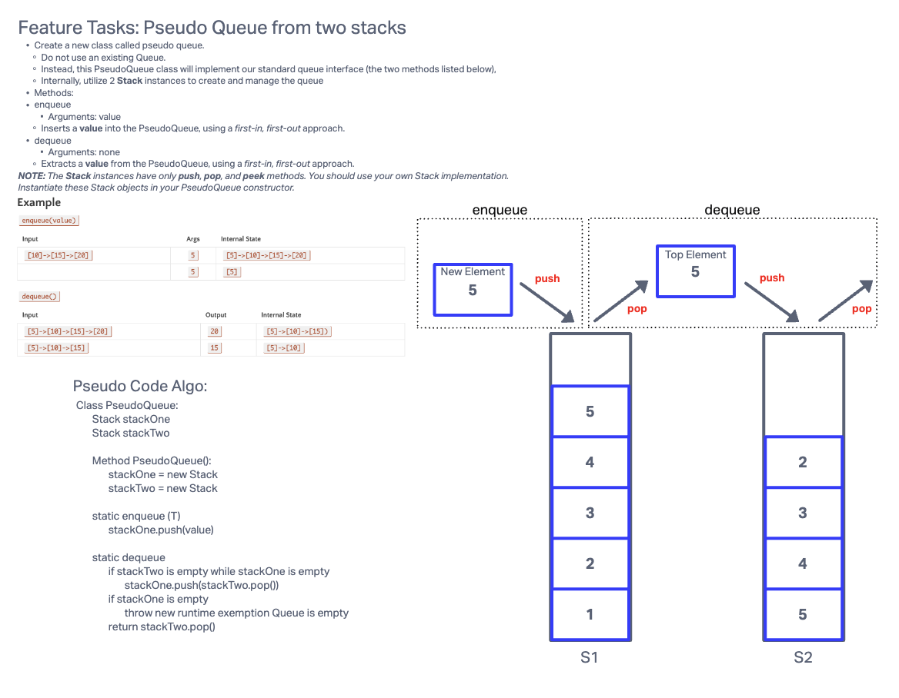

# Challenge: CLass 11

**Branch Name**: stack-queue-pseudo

**Challenge Type**: Code Challenge/Algorithm

### Feature Tasks: 

1. ***Create a new class called pseudo queue.***
   * Do not use an existing Queue.
   * Instead, this PseudoQueue class will implement our standard queue interface (the two methods listed below)
   * Internally, utilize 2 `Stack` instances to create and manage the queue.

2. ***Methods***:
    * enqueue
      * Arguments: value
      * Inserts a value into the PseudoQueue, using a FIFO approach
    * dequeue
      * Arguments: none
      * Extracts a value from the PseudoQueue, using a FIFO approach.

        
**NOTE**: The `Stack` instances have only `push`, `pop`, and `peek` methods. You should use your own stack implementation.
Instantiate these Stack objects in your PseudoQueue constructor.

## Whiteboard Process

## Approach & Efficiency
dequeue is O(N) everything else is O(1)

## Solution
```java
public class PseudoQueue<T> {
    private Stack<T> stackOne; // Renamed from stackPush
    private Stack<T> stackTwo; // Renamed from stackPop

    public PseudoQueue() {
        stackOne = new Stack<>();
        stackTwo = new Stack<>();
    }

    public void enqueue(T value) {
        stackOne.push(value);
    }

    public T dequeue() {
        if (stackTwo.isEmpty()) {
            while (!stackOne.isEmpty()) {
                stackTwo.push(stackOne.pop());
            }
        }
        if (stackTwo.isEmpty()) {
            throw new RuntimeException("Queue is empty");
        }
        return stackTwo.pop();
    }

    public boolean isEmpty() {
        return stackOne.isEmpty() && stackTwo.isEmpty();
    }

    public int size() {
        return stackOne.size() + stackTwo.size();
    }
```
