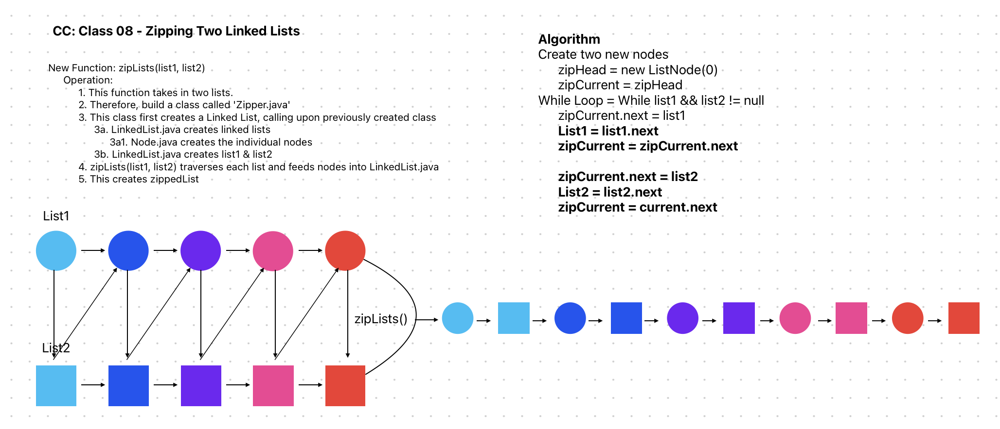

# Code Challenge: Class 8: Zipping two linked lists

Challenge Type: Code Challenge / Algorithm

Feature Tasks
* Write a function called zip lists
* Arguments: 2 Linked Lists
* Return: New Linked List, zipped as noted below
* Zip the two linked lists together into one so that the nodes alternate between the two lists and return a reference to the zipped list.
* Try and keep additional space down to O(1)
* You have access to the Node class and all the properties on the Linked List class as well as the methods created in previous challenges.

## Whiteboard Process

## Approach & Efficiency
Decided to approach by creating a new list called zip list so it was understood what was new and what was old.
Deleted the lists after they were used
## Solution
<!-- Show how to run your code, and examples of it in action -->